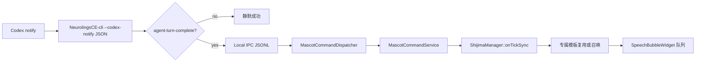

# NeurolingsCE Codex 桌宠通知集成

## 范围与依据

阶段一使用 Codex 官方 `notify` 回调，不旁听或控制 ChatGPT 桌面端任务。Codex
目前会以单个 JSON 参数调用外部命令，并为 `agent-turn-complete` 提供
`type`、`thread-id`、`turn-id`、`cwd`、`input-messages` 和
`last-assistant-message` 字段。依据：[Codex Notifications](https://developers.openai.com/codex/config-advanced/#notifications)。

本阶段只显示最终助手消息，不显示用户输入、完整工作路径、线程/回合 ID，也不
持久化正文。未知事件静默成功，审批请求不处理、不自动批准。

## 阶段一事件流



CLI 与桌宠运行时通过本地 IPC server
`io.github.qingchenyouforcc.NeurolingsCE.cli` 通信。请求形状为：

```json
{
  "command": "show_codex_notification",
  "payload": {
    "type": "agent-turn-complete",
    "thread-id": "opaque",
    "turn-id": "opaque",
    "cwd": "C:/work",
    "input-messages": [],
    "last-assistant-message": "完成摘要"
  }
}
```

`MascotCommandService` 只在 GUI 线程中调用管理器。它读取
`codex/enabled` 与 `codex/companionTemplate`：优先选择 session list 中最早
仍在运行且模板匹配的实例，没有实例时召唤；缺失模板回退到 bundled `Default`
Mascot（内部模板名为 `@`，设置值保留并在日志提示）。通知状态统一使用 `CodexActivityState`，当前完成
事件映射到 `Ready`，并为 `Running`、`NeedsInput`、`Blocked` 留出内部状态。

气泡内容是结构化的“Codex · 已完成”标题和正文摘录。进入队列前先统一换行、
压缩多余空行，并按 Unicode grapheme 边界保留最多 4096 个字素的开头与结尾；
正文布局阶段再用与绘制相同的字体、宽度和 8 行高度预算二分查找单页摘录，
中间显示独立的 `…`（极端大字体时退化为行内或前缀省略）。单条显示以 8 秒
为基础，按可见字素增加到最多 12 秒，最多 8 条待显示项；满队列丢弃最旧待
显示项并只记录元数据。气泡约束到 360×240 逻辑像素；普通点击气泡仍居中
显示 3 秒。

## Codex 配置托管

设置页的 Codex 分区提供独立开关、模板下拉框和测试通知按钮。启用时显示
`$CODEX_HOME/config.toml`，未设置时为用户目录下 `.codex/config.toml`，并在
用户确认后以 `QSaveFile` 写入：

```toml
# BEGIN NeurolingsCE Codex notify
notify = ["<绝对路径>/NeurolingsCE-cli(.exe)", "--codex-notify"]
# END NeurolingsCE Codex notify
```

每次实际改动先创建带 UTC 时间戳的 `.bak.*` 备份；相同内容不重复写入。托管
块只更新自身。若块外已有 Codex Desktop 自带的
`codex-computer-use(.exe) turn-ended` 回调，则将原行以 Base64 注释保存在托管块中，
NeurolingsCE CLI 收到同一 JSON 后以参数数组方式（不经过 shell）转发给原回调；
禁用时原样恢复该行。这样在 Codex 仅支持一个 `notify` 命令的约束下，桌宠通知与
Computer Use 可以共存。其他块外 `notify =` 仍拒绝覆盖并给出可复制命令。应用
启动、安装器和后台流程不会静默改动 Codex 配置。

兼容早期 NeurolingsCE 版本写入的无标记命令：仅当块外的数组严格匹配
`NeurolingsCE-cli(.exe)` 与 `--codex-notify` 时，将该旧行原子迁移为带标记的托管块；
其他命令仍按外部 `notify` 冲突处理，不会被覆盖。若同目录下找不到
`NeurolingsCE-cli(.exe)`，启用操作直接失败，避免写入无法执行的回调。

## 阶段二记录：app-server

后续可以接入 [Codex app-server](https://developers.openai.com/codex/app-server/)
的 stdio JSONL JSON-RPC 风格协议，使用 `initialize`/`initialized`、turn/item
事件和审批 server request 做更丰富的活动映射。它将形成 NeurolingsCE 自己
管理的 Codex 客户端会话；不能假定能够旁听现有 ChatGPT 桌面端任务。阶段二
不在本次启动，不实现输入框、聊天列表、点击跳转或审批选择；如将来处理审批，
必须采用明确的用户选择并保持默认拒绝。

Pets 文档定义的 Running / Needs input / Ready / Blocked 状态可作为后续状态色
调和生命周期依据：[Pets](https://learn.chatgpt.com/docs/pets)。

## 验证矩阵

- CLI：缺参、多参、非法/超限 JSON、未知事件、有效完成事件、`--json`，以及
  Windows Unicode 命令行中的中英文和 emoji 无损传递。
- IPC：payload 类型、错误码/大小限制、未知事件成功、服务调用和 GUI 线程边界。
- 自动化：`NeurolingsCETests` 覆盖规范化与队列前压缩，`NeurolingsCEBubbleTests`
  使用 Qt offscreen 平台覆盖字体布局、二分摘录、Unicode 字素安全和显示时长。
- UI：模板复用/召唤/回退、队列上限、空回复、中英文/emoji/多行 grapheme
  首尾摘录、4096 个连续 emoji 不死循环、8 行/360×240 布局、8–12 秒 Codex
  气泡与 3 秒普通气泡、多显示器定位。
- 配置：临时目录创建、备份、幂等更新、Windows 路径转义、冲突拒绝、Computer
  Use 转发/恢复、缺失 CLI 拒绝和精准卸载。
- 设置：确认对话、键盘导航、深浅色/高 DPI、独立开关，以及不发生静默写配置。
