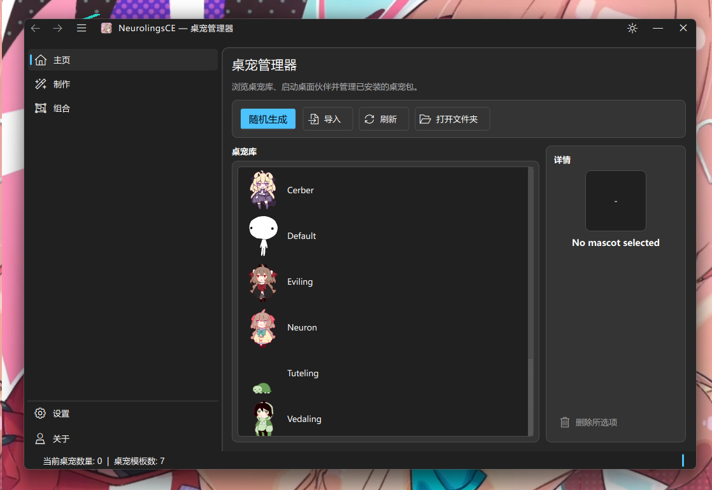

#  NeurolingsCE


**[English](README_EN.md) | 中文**

> [!NOTE]
**该应用0.x.x版本均为测试版！有bug请及时在Issue反馈！**

当前发布版本为 [v0.5.3](https://github.com/qingchenyouforcc/NeurolingsCE/releases/tag/0.5.3)。

跨平台桌面看板娘（Shimeji）应用，基于 [Shijima-Qt](https://github.com/pixelomer/Shijima-Qt) 深度修改而来。

使用 C++17 / Qt6 构建，支持 Windows、Linux 和 macOS。



截图展示管理器窗口；v0.5.3 的嵌入式“关于”页和 Codex 页面可从同一管理器导航进入。

## 特性

- 🖥️ 跨平台支持（Windows / Linux / macOS）
- 🎭 兼容 Shimeji-ee 格式的看板娘资源包
- 📦 拖放导入看板娘压缩包
- 🛠️ 制作页 — 检查 Shimeji zip 并转换为 `.mascot`
- 🧩 桌宠组合 — 保存当前桌宠组，并在需要时恢复
- 🚀 开机自启与静默恢复 — Windows 可开机启动并恢复上次或指定组合
- 🪟 窗口模式 — 在独立沙盒窗口中运行看板娘
- 🖱️ 鼠标交互 — 拖拽、右键菜单
- 🧰 独立 CLI — 用 `NeurolingsCE-cli` 管理模板和控制运行时
- 🎨 Fluent 管理器体验 — 主题感知的页面、对话框和响应式布局
- ℹ️ 嵌入式“关于”页 — 在管理器导航中查看版本、更新和项目支持信息
- 🤖 Codex app-server 工作流 — 显式连接私有会话，查看计划、审批和用户输入，不自动批准
- 📡 HTTP REST API（`localhost:32456`）
- 🔐 安全更新检查 — 使用静态更新清单并校验下载产物
- 🌐 多语言支持（English / 中文简体）
- 🔊 可选的音效支持（Qt Multimedia）
- 🖥️ 多显示器支持
- 📐 自定义缩放

## 下载

- [v0.5.3 发布页](https://github.com/qingchenyouforcc/NeurolingsCE/releases/tag/0.5.3)
- [最新版本](https://github.com/qingchenyouforcc/NeurolingsCE/releases/latest)
- [所有版本](https://github.com/qingchenyouforcc/NeurolingsCE/releases)

### v0.5.3 发布资产

| 平台 | 文件 | 说明 |
|------|------|------|
| Windows | [NeurolingsCE_windows_x86_64_v0.5.3.msi](https://github.com/qingchenyouforcc/NeurolingsCE/releases/download/0.5.3/NeurolingsCE_windows_x86_64_v0.5.3.msi) | Windows MSI 安装器 |
| Windows | [NeurolingsCE_windows_x86_64_v0.5.3-setup.exe](https://github.com/qingchenyouforcc/NeurolingsCE/releases/download/0.5.3/NeurolingsCE_windows_x86_64_v0.5.3-setup.exe) | Windows setup 引导安装器 |
| Windows | [NeurolingsCE_windows_x86_64_v0.5.3.zip](https://github.com/qingchenyouforcc/NeurolingsCE/releases/download/0.5.3/NeurolingsCE_windows_x86_64_v0.5.3.zip) | Windows 便携版 |
| Linux x86_64 | [NeurolingsCE_linux_x86_64_v0.5.3.AppImage](https://github.com/qingchenyouforcc/NeurolingsCE/releases/download/0.5.3/NeurolingsCE_linux_x86_64_v0.5.3.AppImage) | Linux x86_64 AppImage |
| Linux arm64 | [NeurolingsCE_linux_arm64_v0.5.3.AppImage](https://github.com/qingchenyouforcc/NeurolingsCE/releases/download/0.5.3/NeurolingsCE_linux_arm64_v0.5.3.AppImage) | Linux arm64 AppImage |
| macOS Apple Silicon | [NeurolingsCE_macos_arm64_v0.5.3.zip](https://github.com/qingchenyouforcc/NeurolingsCE/releases/download/0.5.3/NeurolingsCE_macos_arm64_v0.5.3.zip) | macOS arm64 版本 |
| macOS Intel | [NeurolingsCE_macos_x86_64_v0.5.3.zip](https://github.com/qingchenyouforcc/NeurolingsCE/releases/download/0.5.3/NeurolingsCE_macos_x86_64_v0.5.3.zip) | macOS x86_64 版本 |
| 所有平台 | [NeurolingsCE_mascot_pack_v0.5.3.zip](https://github.com/qingchenyouforcc/NeurolingsCE/releases/download/0.5.3/NeurolingsCE_mascot_pack_v0.5.3.zip) | 六个官方 mascot 包 |
| 所有平台 | [SHA256SUMS.txt](https://github.com/qingchenyouforcc/NeurolingsCE/releases/download/0.5.3/SHA256SUMS.txt) | 所有发布资源的 SHA-256 校验和 |

## 商店、GitHub 登录与 Codex

0.5.3 默认使用公开的 Staging registry：

```text
https://blog.qingchenyou.asia/NeurolingsCE-Mascots-Staging/index-v1.json
```

商店当前列出六个官方 `.mascot` 包：Cerber、Eviling、Neuron、Tuteling、Vedaling
和 Weuron，均标记为 `CC-BY-NC-SA-4.0`。内置的 Default Mascot 来自上游 Shijima-Qt，
不作为用户原创包列入该列表。
商店卡片会分别展示名称、版本、简介、来源、大小、许可证及下载/安装状态；下载完成后先
校验 SHA-256，再安装到本地模板库。该地址是公开 Staging 内容源，不代表生产目录。

商店中的 GitHub 登录使用公开 GitHub App 的 Device Flow：按窗口显示的 URL 和验证码在
浏览器中授权，成功后登录弹窗会自动关闭并刷新账号状态。取消、过期或网络错误会保留明确
反馈；访问令牌只写入系统安全凭据存储，客户端不包含维护者 token 或 secret。

Codex notify 集成会处理新会话标题事件。若 Codex 将标题和简介作为 JSON 消息返回，客户端
只提取允许的字段并显示可读标题，不会把原始 JSON 直接显示，也不会自动批准请求。

v0.5.3 还提供显式连接的 Codex app-server 页面：连接私有会话后可查看线程、计划、回复、审批
和用户输入请求；JSON-RPC 载荷有边界限制，关闭时会取消待处理请求，审批始终由用户决定。

## 文档

📖 **[Wiki 文档](https://github.com/qingchenyouforcc/NeurolingsCE/wiki)** — 包含快速开始、构建指南、架构说明、HTTP API、常见问题等完整文档。

## 0.3.3 以来的主要更新

当前 `main` 对应最新的 `v0.5.3` 发布，下面列出从 `0.3.3` 以来的主要用户可见更新：

- 新增桌宠组合页，可保存当前运行中的多只桌宠，并恢复上次关闭前的组合。
- 模板列表支持双击生成匹配桌宠，减少选择和召唤步骤。
- 新增“制作”页，可检查旧 Shimeji `.zip` 并转换为 NeurolingsCE `.mascot` 包。
- 增强 `.mascot`/旧版 ZIP 包验证、图片检查、解包与重命名失败处理。
- 更新检查改为请求 GitHub Pages 上的静态 `latest.json`，避免客户端直连 GitHub API 触发限流。
- 更新下载支持 SHA-256 校验；发布 asset 名称会先清理再写入本地缓存。
- Windows 支持开机自启、静默启动，以及启动时恢复上次或指定桌宠组合。
- CI 增加 macOS Intel/Apple Silicon 构建，并验证受支持的 GUI/CLI 构建目标；废弃的独立测试目标已移除。
- 商店默认切换到公开 Staging registry，补充六个官方桌宠包及可读的卡片详情。
- 管理器页面和对话框统一使用 Fluent/Ela 主题表面、键盘焦点和响应式操作布局。
- 新增嵌入式“关于”页，集中展示身份、版本、更新和项目支持信息，更新通知会直接进入该页面。
- 新增需显式连接的 Codex app-server 工作流，可查看计划、回复、审批和用户输入请求，且不会自动批准。
- 补全刷新管理器页面、Codex 控件及可访问性标签所需的简体中文翻译。
- 修复 GitHub Device Flow 授权完成后的弹窗生命周期，并刷新登录账号状态。
- 修复 Codex 新会话标题返回 JSON 时的适配，只显示允许的标题/简介字段。

## 制作

主界面的“制作”页可以把旧 Shimeji `.zip` 资源包转换为 NeurolingsCE 使用的 `.mascot` 包。选择 zip 后先执行内容检查；如果压缩包中包含多只桌宠，可以勾选要转换的条目。转换结果会写入你选择的输出目录，不会自动导入模板库。

## 桌宠组合与启动恢复

“组合”页用于保存当前屏幕上的桌宠组。你可以把多个已经召唤的桌宠保存为一个组合，之后一键恢复；程序关闭前也会记录最后一次组合状态。

Windows 用户可以在“设置 → 启动”中开启开机自启。开启静默启动后，系统登录时程序会留在托盘中，并按设置恢复“上次关闭前组合”或某个已保存组合。

## 更新机制

客户端更新检查现在读取静态清单：

```text
https://blog.qingchenyou.asia/NeurolingsCE/update/latest.json
```

这个清单由 GitHub Actions 在发布 Release 后生成并部署到 GitHub Pages。客户端不再请求 `api.github.com/repos/.../releases/latest`，因此不会再因为共享出口 IP 触发 GitHub REST API 未认证限流。下载到本地的安装包会通过清单中的 `sha256` 或 `SHA256SUMS.txt` 校验后才允许安装。

维护者发布新版本时，请确认仓库 Pages 来源为 GitHub Actions，并运行 `Publish update manifest` workflow；该 workflow 会从 GitHub Release 的官方 digest 生成确定性的 `SHA256SUMS.txt`，补传后重新读取 Release 元数据，再部署 `latest.json`。清单包含所有非 `SHA256SUMS.txt` 的自定义资产（包括 mascot pack），不包含 GitHub 自动生成的 source archive。如果 Release assets 是发布后才补传的，重新运行该 workflow 即可同步校验清单。

SUMS 生成器和离线测试位于 `tools/generate_sha256sums.py` 与 `tools/tests/`，可用下面的命令运行测试：

```powershell
python -m unittest discover -s tools/tests -p "test_*.py"
```

## 日志与调试

NeurolingsCE 默认启用 session 日志。每次启动都会创建独立日志文件，用于记录 GUI/CLI 启动、HTTP API、Local IPC、看板娘导入/召唤/关闭、素材包处理、更新检查、音频、平台窗口观察和崩溃路径等关键操作。

日志级别包括：

- `debug`：详细调试信息，包括经过采样或节流的高频运行状态。
- `info`：正常生命周期、服务启动停止、用户可见操作和成功摘要。
- `warning`：可恢复异常、无效输入、跳过项或业务 4xx 类失败。
- `error`：操作失败、服务错误、导入失败、网络/解析失败等需要排查的问题。
- `critical`：崩溃、Qt fatal、`std::terminate`、SEH 未处理异常等不可恢复错误。

默认最低日志级别为 `info`。需要更详细日志时，可以在启动前设置环境变量：

```powershell
$env:NEUROLINGSCE_LOG_LEVEL="debug"
$env:NEUROLINGSCE_LOG_STDERR="1"
.\NeurolingsCE.exe
```

支持的 `NEUROLINGSCE_LOG_LEVEL` 值为 `debug`、`info`、`warning`、`error`、`critical`。`NEUROLINGSCE_LOG_STDERR=1` 会把日志同时输出到 stderr，适合从终端启动或调试 CLI。

Windows 默认日志目录：

```text
%LOCALAPPDATA%\NeurolingsCE\log\YYYY-MM-DD\neurolingsce-HH-mm-ss-zzz.log
```

Linux/macOS 会优先写入 Qt 的 `AppLocalDataLocation/log`，如果不可用则回退到用户 home 下的 `.neurolingsce/log`；如果首选目录无法创建，程序会尝试写入系统临时目录下的 `NeurolingsCE/log`。

排查问题时，建议按下面步骤收集日志：

1. 设置 `NEUROLINGSCE_LOG_LEVEL=debug`。
2. 重新启动 NeurolingsCE 或 `NeurolingsCE-cli`。
3. 复现问题。
4. 附上最新 session log。日志会记录路径、ID、命令名、状态码、错误摘要和关键计数，但不会记录完整请求体、图片内容、XML/JSON 大文本或二进制内容。

## 构建

### 前置依赖

- C++17 编译器（MSVC 2022 / GCC / Clang）
- Qt 6.8+（Core, Gui, Widgets, Concurrent, LinguistTools）
- CMake 3.21+（Windows/MSVC）或 Make（Linux/macOS）

剩余外部子模块需要初始化（`libshimejifinder`、`cpp-httplib`、`ElaWidgetTools`）：

```bash
git submodule update --init --recursive
```

### Windows（MSVC + CMake）

Windows 上 Ninja + MSVC 请使用仓库提供的构建入口，保证 configure 与 build 在同一控制台代码页下执行。CMake 在 configure 时按控制台输出代码页生成 `msvc_deps_prefix`，Ninja 按字节匹配 cl 的 `/showIncludes` 输出；若两者代码页不一致（例如从 UTF-8 的 PowerShell 会话运行），依赖前缀会变成乱码，Ninja 不再记录头文件依赖，导致改动头文件后陈旧对象不会重新编译。

```bash
src\tools\build-windows-ninja.cmd build Release   # Debug / RelWithDebInfo 同样可用
```

脚本会固定控制台代码页（中文 Windows 为 936）、加载 MSVC 环境、用 Ninja 配置并构建。可通过环境变量 `NEUROLINGSCE_BUILD_CODEPAGE` 覆盖代码页（例如其他语言环境）。等价的原始命令必须在同一个 `cmd` 会话中运行：

```bash
cmd /c "chcp 936 >nul && cmake -S . -B build -G Ninja -DCMAKE_BUILD_TYPE=Release -DQt6_DIR=D:/Qt/6.8.3/msvc2022_64/lib/cmake/Qt6 && cmake --build build --parallel"
```

也可以直接用 Visual Studio 打开项目，在 `CMakeSettings.json` 中已配置好 `x64-Debug` 和 `x64-Release` 两个方案。

#### Windows 快速打包 bin 目录

如果你已经通过 Visual Studio/CMake 构建好了 `out/build/x64-Release/bin`，可以直接运行：

```powershell
powershell -ExecutionPolicy Bypass -File .\src\tools\package-windows-bin.ps1
```

默认行为：

- 读取 `VERSION.txt` 生成输出目录名
- 将 `out/build/x64-Release/bin` 复制到 `out/package/NeurolingsCE_windows_x86_64_v<version>`
- 若 `VERSION_NAME=Alpha`，会自动追加 `a` 后缀，例如 `NeurolingsCE_windows_x86_64_v0.3.0a`
- 默认排除 `log/`、`shijima_stdout.txt`、`shijima_stderr.txt`
- 同时生成 zip 包，便于测试分发或作为后续 MSI 输入目录

常用参数：

```powershell
powershell -ExecutionPolicy Bypass -File .\src\tools\package-windows-bin.ps1 `
  -SourceDir out/build/x64-Release/bin `
  -OutputRoot out/package `
  -SkipVcRedist `
  -SkipZip
```

#### Windows MSI（WiX）

仓库现在也包含了一个 WiX 打包入口，建议流程是：

1. 先运行 `package-windows-bin.ps1` 生成干净发布目录
2. 再运行 `installer/wix/build-msi.ps1` 生成 MSI
3. 如果需要把 `vc_redist.x64.exe` 正式串进安装流程，再运行 `installer/wix/build-bundle.ps1` 生成引导安装器 EXE

```powershell
powershell -ExecutionPolicy Bypass -File .\installer\wix\build-msi.ps1
```

```powershell
powershell -ExecutionPolicy Bypass -File .\installer\wix\build-bundle.ps1
```

如果你还没安装 WiX，可以先只生成 `.wxs` 文件检查内容：

```powershell
powershell -ExecutionPolicy Bypass -File .\installer\wix\build-msi.ps1 -GenerateOnly
```

### Windows（MinGW 交叉编译 via Docker）

```bash
docker build -t neurolingsce-dev dev-docker
docker run -e CONFIG=release --rm -v "$(pwd)":/work neurolingsce-dev bash -c 'mingw64-make -j$(nproc)'
```

### Linux

安装 Qt6 开发依赖后：

```bash
CONFIG=release make -j$(nproc)
```

### macOS

支持 Apple Silicon（arm64）与 Intel（x86_64）。Qt6 可通过 Homebrew 或 MacPorts 安装；下面以 Homebrew 为推荐路径，因为它和 macOS 上的 CMake 流程对齐得最好。

1. 安装依赖（Homebrew，推荐）：

```bash
brew install qt qttools libarchive cmake pkg-config
```

   或使用 MacPorts：

```bash
sudo port install qt6-qtbase qt6-qtmultimedia qt6-qttools pkgconfig libarchive cmake
```

2. 构建（推荐使用 CMake，与其他平台一致）：

```bash
cmake -B build -G "Unix Makefiles" -DCMAKE_BUILD_TYPE=Release \
  -DQt6_DIR="$(brew --prefix qtbase)/lib/cmake/Qt6"
cmake --build build -j$(sysctl -n hw.ncpu)
```

   构建产物会输出到 `build/bin/`，包括 `NeurolingsCE`、`NeurolingsCE-cli` 以及测试可执行文件 `NeurolingsCETests`。

   如果使用 MacPorts，把 `Qt6_DIR` 改为 `/opt/local/libexec/qt6/lib/cmake/Qt6` 即可。

3. （备选）使用顶层 Makefile：

```bash
CONFIG=release make -j$(sysctl -n hw.ncpu)
```

   `common.mk` 在 macOS 上会自动探测 Homebrew 的 `qtbase`、`qtmultimedia`、`qttools` 与 `libarchive`；如果同时安装了 MacPorts，也会回退到 `/opt/local/libexec/qt6`。如需指定其他 Qt 路径，可在命令行覆盖：

```bash
CONFIG=release make QT_MACOS_PATH=/your/Qt/lib \
  MOC=/your/Qt/libexec/moc RCC=/your/Qt/libexec/rcc \
  LRELEASE=/your/Qt/bin/lrelease -j$(sysctl -n hw.ncpu)
```

## 平台说明

### Windows

仅支持 x64 工具链。已在 Windows 11 上测试，Windows 10 应该也可以工作。窗口追踪开箱即用。

### Linux

支持 KDE Plasma 6 和 GNOME 46（Wayland / X11）。首次运行时会自动安装 shell 插件来获取前台窗口信息：
- **KDE** — 对用户透明，无需操作。
- **GNOME** — 首次运行后需要重新登录以重启 Shell。程序会给出相应提示。
- **其他桌面环境** — 窗口追踪不可用。

### macOS

需要辅助功能（Accessibility）权限来获取前台窗口。最低系统版本 macOS 13。

## HTTP API

内置 HTTP REST API 运行在 `http://127.0.0.1:32456`，可用于外部程序控制看板娘。

详细文档见 [src/docs/HTTP-API.md](src/docs/HTTP-API.md)。

## CLI

项目现在提供独立的控制台 CLI 程序 `NeurolingsCE-cli`。模板管理命令可独立运行；
运行时 mascot 控制命令会在需要时自动启动 NeurolingsCE 运行时，再通过本地 IPC 控制它。

- 全局选项：`--quiet`、`--json`、`--connect-timeout-ms`、`--read-timeout-ms`
- 文档命令：`--help/-h`、`--summon/-s`、`--close`、`--close-all`、`--stop`、`--mascot/-m`、`--list/-l`、`--version/-v`
- `--summon` 支持两种形式：
  - `--summon mascot --name NAME [label]`
  - `--summon mascot --data-id ID [label]`
  - `--summon random [label]`
- `label` 是面向用户的 CLI 标签，不等于运行时 mascot ID，只在当前应用进程存活期间有效
- `--mascot/-m` 支持模板管理：
  - `--mascot list`
  - `--mascot add ZIP`
  - `--mascot remove MASCOT`
- `--mascot/-m` 不需要主程序已运行；它直接读写本机模板目录
- `--stop` 会关闭全部桌宠并停止 NeurolingsCE 运行时；如果运行时未启动，不会为了停止而新启动它
- 兼容旧命令：`list`、`list-loaded`、`spawn`、`alter`、`dismiss`、`dismiss-all`
- `--json` 会输出稳定的结构化结果与错误对象
- `--host` 和 `--port` 不再支持；CLI 不走 HTTP
- 在 Windows 上建议直接调用 `NeurolingsCE-cli.exe`，这样 shell/agent 能稳定获取退出码

详细命令格式见 [src/docs/HTTP-API.md](src/docs/HTTP-API.md) 中的 CLI 部分。

## NeurolingsCE-Skill

仓库内提供了一个配套 skill：`neurolingsce-skill/`，用于指导 agent 通过 `NeurolingsCE-cli.exe` 控制已安装的桌宠模板。

- skill 名称：`NeurolingsCE-Skill`
- 机器名：`neurolingsce-skill`
- 默认行为：只调用 `NeurolingsCE-cli.exe`；除非用户明确要求，否则不启动 `NeurolingsCE.exe`、不打开 GUI、也不启动 runtime mode
- 语义约定：当用户说“帮我生成一只 xxx 桌宠”时，含义是 `summon` 一个**已安装模板**，不是生成桌宠资源、图片、sprites、XML 或 ZIP
- 如果没有找到对应模板，agent 应直接提示“没有这个模板 / 模板未安装”，而不是自行创建或替换成别的桌宠

常用辅助脚本：

```powershell
python neurolingsce-skill/scripts/find_neurolingsce_cli.py
python neurolingsce-skill/scripts/summon_companion.py
```

- `find_neurolingsce_cli.py`：在显式路径、常见构建目录、`PATH` 和常见安装位置中搜索 `NeurolingsCE-cli.exe`，并记录到 `neurolingsce-skill/cache/neurolingsce-cli-path.json`
- `summon_companion.py`：随机召唤一只**非默认**已安装桌宠；如果只有默认模板，则只返回“没有可用的非默认模板”，不会创建资源

## 项目结构

```
NeurolingsCE/
├── src/app/              # Qt 应用层（core/runtime/ui 分层）
├── src/platform/Platform/ # 平台抽象层（Windows/Linux/macOS）
├── include/shijima-qt/   # 公共头文件
├── src/app/core/shijima-engine/ # 内置核心看板娘模拟引擎源码
├── libshimejifinder/     # [子模块] 看板娘资源包导入/解压
├── cpp-httplib/          # [子模块] HTTP 服务器（header-only）
├── translations/         # i18n 翻译文件
├── cmake/                # CMake 辅助脚本
├── src/assets/           # 内置默认看板娘资源
└── src/packaging/        # 桌面入口、图标、AppStream 元信息
```

`src/app` 目前按职责拆分为三层：

- `src/app/core/`：资源加载、音效、HTTP API、压缩包导入等基础能力
- `src/app/runtime/`：`ShijimaManager` 的环境同步、导入流程、生命周期与运行时调度
- `src/app/ui/`：管理器窗口、托盘、页面构建、桌宠窗口交互、对话框与部件

实现切片统一使用“主体 + 职责”的文件命名，例如 `ManagerImportWorkflow.cc`、`ManagerWindowSetup.cc`、`MascotWidgetRendering.cc`，方便按文件名直接定位业务边界。

## 致谢

本项目基于 [pixelomer](https://github.com/pixelomer) 的 [Shijima-Qt](https://github.com/pixelomer/Shijima-Qt) 开发，在此基础上进行了大量修改和功能增强。

本项目最早是为 "[Neurolings](https://x.com/Monikaphobia/status/1844272129619132682?s=20)" 而做的迁移版本，现在转为通用Shimeji桌宠核心/管理器程序

核心依赖：
- [libshijima](https://github.com/pixelomer/libshijima) — 已整合进 `src/app/core/shijima-engine` 的看板娘模拟引擎
- [libshimejifinder](https://github.com/pixelomer/libshimejifinder) — 资源包解析
- [cpp-httplib](https://github.com/yhirose/cpp-httplib) — HTTP 库
- [Qt 6](https://www.qt.io/) — GUI 框架

软件 ICO 致谢：
- 感谢 [宅笙Zhai_Sheng](https://space.bilibili.com/49541366) 绘制软件 ICO


## 联系方式

- **作者**：[轻尘呦](https://space.bilibili.com/178381315)
- **项目地址**：https://github.com/qingchenyouforcc/NeurolingsCE
- **问题反馈**：[GitHub Issues](https://github.com/qingchenyouforcc/NeurolingsCE/issues)
- **交流 QQ 群**：125081756

**如果你对neuro社区项目开发感兴趣的话**

**可以联系我加入NeuForge Center**

**请加入Q群了解更多内容**

## 许可证

本项目基于 [GNU General Public License v3.0](LICENSE) 开源。

### GPLv3 附加条款

在遵守 GPLv3 的基础上，任何再发布、修改版本或衍生作品还必须遵守以下要求：

- 保留原始版权声明、许可证声明以及相关归属信息。
- 不得冒充本项目的官方版本，或以任何可能造成混淆的方式表示其为官方发布版本。
- 未经项目权利人明确许可，不得使用本项目的商标、Logo、项目名称，或以这些标识暗示官方背书、认可或关联。

上游项目 Shijima-Qt 的 README 见 [Shijima-Qt_README.md](Shijima-Qt_README.md)。


---
## 广告位

(如果你需要宣传请来联系我)

如果你对neuro同人文感兴趣的话，请加入文学社谢谢喵

**NeuroEcho文学社QQ群1063898428**

---

## Star 趋势

[](https://star-history.com/#qingchenyouforcc/NeurolingsCE&Date)
